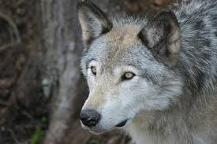

# wolf-project
<!doctype html>

<html lang="en">
<head>
  <meta charset="utf-8">

  <title>The HTML5 Herald</title>
  <meta name="description" content="About the wolf">
  <meta name="author" content="Wikipedia">

  <link rel="stylesheet" href="https://stackpath.bootstrapcdn.com/bootstrap/4.4.1/css/bootstrap.min.css" integrity="sha384-Vkoo8x4CGsO3+Hhxv8T/Q5PaXtkKtu6ug5TOeNV6gBiFeWPGFN9MuhOf23Q9Ifjh" crossorigin="anonymous">

</head>

<body>
	<h1>The Gray Wolf</h1> 
	<b>
</b>
	<!-- Standard button -->
<!--<button type="button" class="btn btn-default">Default</button>
<!-- Provides extra visual weight and identifies the primary action in a set of buttons -->
<a href="survival.html"><button type="button" class="btn btn-primary">Survival</button></a>	
<a href="population.html"><button type="button" class="btn btn-primary">Population</button></a>

<!-- Indicates a successful or positive action -->
<!--<button type="button" class="btn btn-success">Success</button>
<!-- Contextual button for informational alert messages -->
<!--<button type="button" class="btn btn-info">Info</button>
<!-- Indicates caution should be taken with this action -->
<!--<button type="button" class="btn btn-warning">Warning</button>
<!-- Indicates a dangerous or potentially negative action -->
<!--<button type="button" class="btn btn-danger">Danger</button>
<!-- Deemphasize a button by making it look like a link while maintaining button behavior -->
<!--<button type="button" class="btn btn-link">Link</button>-->
 

 
<figure>
	<!---->
	
	
</figure>

	
Gray Wolf Diet

	
smaller animals, livestock, carrion, and garbage.

	
Large wild hooved mammals.

	

	
Gray Wolf Population

	
The global wolf population wolves was estimated to be 300,000 in 2003.

	

	
Gray Wolf Background

	
a large canine native to Eurasia and North America.

	
The wolf is also distinguished from other Canis species by its less pointed ears and muzzle, as well as a shorter torso and a longer tail.

	

 <main>
	
<h3>The wolf (Canis lupus), also known as the gray wolf or grey wolf, is a large canine native to Eurasia and North America.</h3> It is the <a href="https://en.wikipedia.org/wiki/Wolf">largest</a> extant member of Canidae, males averaging 40 kg (88 lb) and females 37 kg (82 lb). On average, wolves measure 105–160 cm (41–63 in) in length and 80–85 cm (31–33 in) at shoulder height. <section><article>The wolf is also distinguished from other Canis species by its less pointed ears and muzzle, as well as a shorter torso and a longer tail.</article> <article>The wolf is nonetheless related closely enough to smaller Canis species, such as the coyote and the golden jackal, to produce fertile hybrids with them.</article></section>  <section>The banded fur of a wolf is usually mottled white, brown, gray, and black.</section> <section id="subspecies">Up to 38 subspecies of wolf have been recognized including the domestic dog. </section>
</main>

  
</body>
</html>
